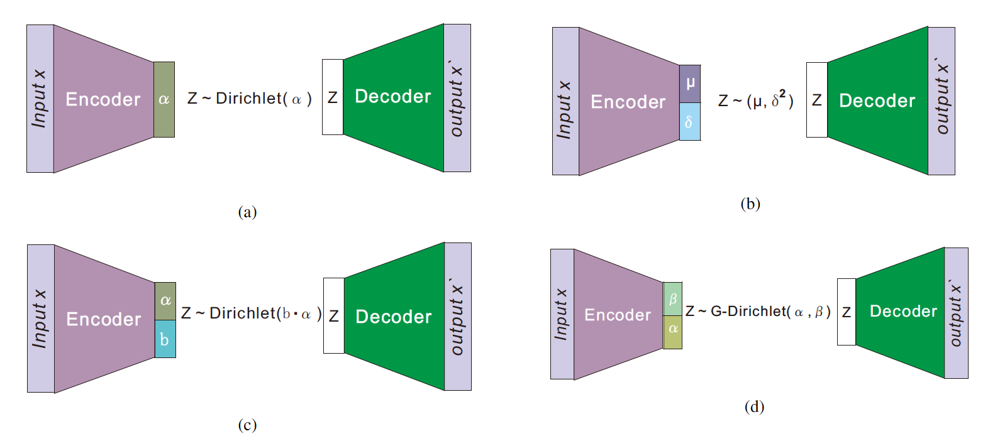

### GD-VAE: Generalized Dirichlet Variational Autoencoder
This reposiory contains implementation of generalized Dirichlet variational autoencoderthe for topic model and image classiffication, see schematic diagram below. Note that some of the codes in the textScript are taken from (https://github.com/sophieburkhardt/dirichlet-vae-topic-models). The Generalized Dirichlet distribution leverages rejection sampling variational inference using a reparameterization trick for effective training. We first applied the proposed model on text, see the [texScripts folder](https://github.com/hormone03/GD-VAE/tree/master/textScripts). We further validate the algorithm on image classification. 

See discussion in the [paper in review]()

Documentation and development are still in progress...
