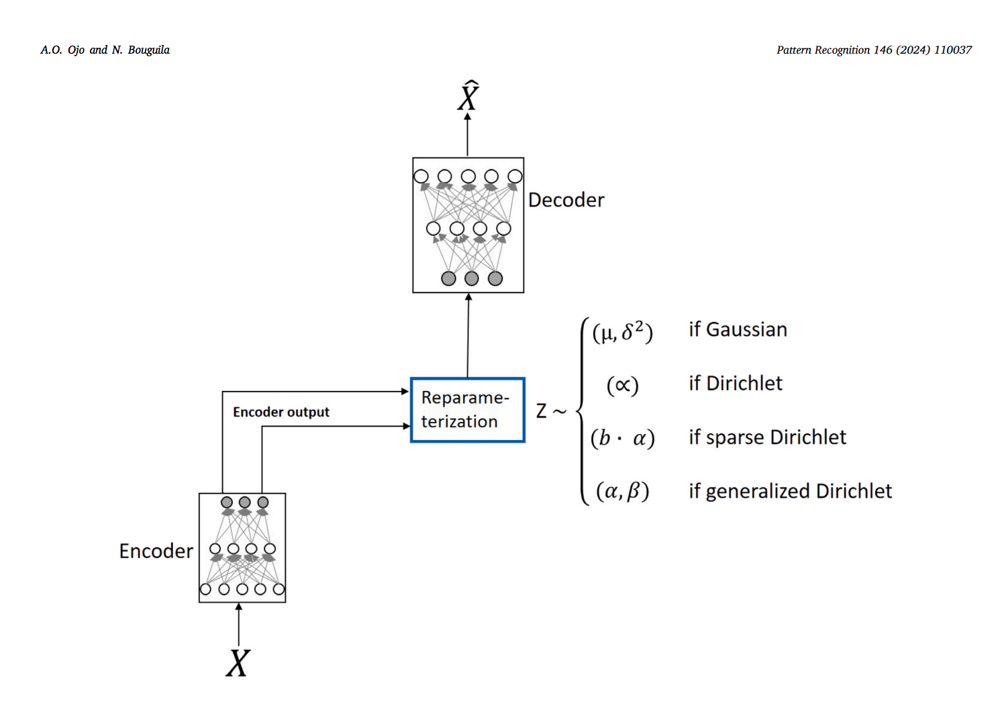

### GDVAE: Generalized Dirichlet Variational Autoencoder
This repository contains the implementation of [A topic modeling and image classification framework: The Generalized Dirichlet variational autoencoder](https://www.sciencedirect.com/science/article/pii/S0031320323007343), see schematic diagram below.  The Generalized Dirichlet model makes use of a rejection sampler and employs a reparameterization trick for efficient training to approximate the variational inference. We first applied the proposed model on text, see the [texScripts](https://github.com/hormone03/GD-VAE/tree/master/textScripts). We further validate the framework with image datasets, see [imageScripts](https://github.com/hormone03/GD-VAE/tree/master/imageScripts). 

### DATA: 
We evaluate GDVAE and the baseline models on three data sets popularly used in topic modeling [20news, KOS, and NIPS], and validate the models' capacities on two popular image data sets [MNIST fashion and digits].

## Running the textScripts:
Set up a virtual environment, install the packages listed in the `requirements.txt` file located in the "textScripts" directory, and execute the step below:

python GDVAE.py 2
## Running the imageScripts:
python GDVAE.py
